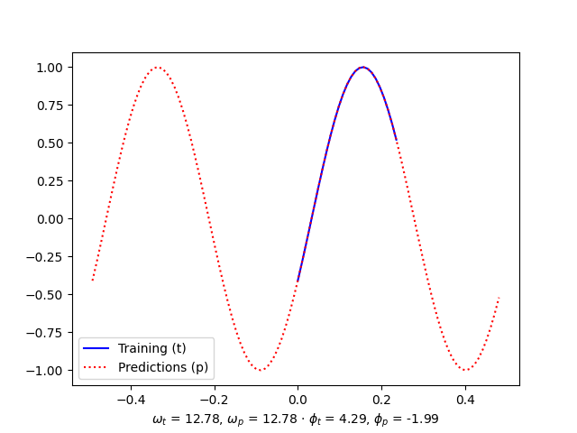
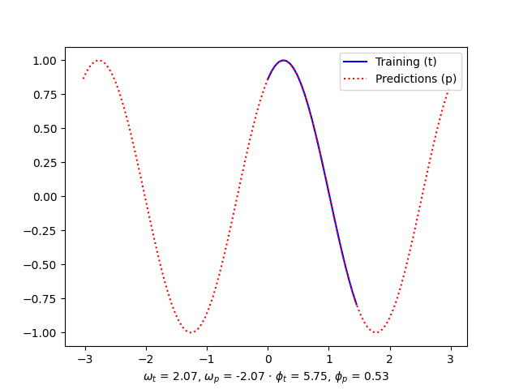
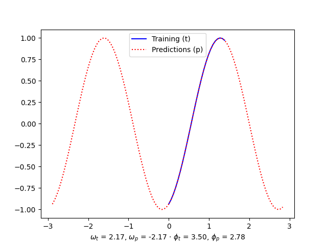
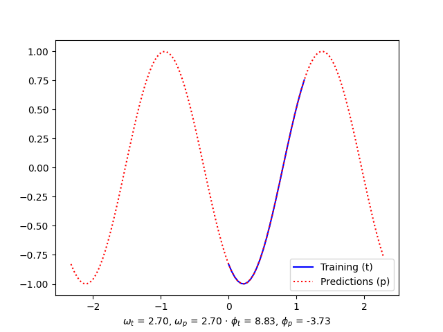

# Kapotic Layers

This project contains a set of crazy layers that I created while learning Tensorflow. The layers in this repository shouldn't be considered ready for production and you shouldn't rely on their principles. These are just fun experiments!

This repository is a natural continuation of my [Hello World](https://github.com/elcapo/hello_world/) neural network example.

## Sinusoid Regression

In this exercise I generate a sinusoid (with a random angular velocity and a random phase) and then use a model with a custom `Cosine` layer to estimate the parameters.

```python
import numpy as np
import matplotlib.pyplot as plt
from kapotic_layers import models

# Prepare the training data

ang_vel = np.random.rand(1)[0] * np.random.randint(1, 25)
phase = np.random.rand(1)[0] * 10
half_period = np.pi / ang_vel

x_train = np.arange(0, half_period, half_period / 25, dtype=float)
y_train = np.cos(ang_vel * x_train + phase)

# Train the model

model = models.train_sinusoidal_regression_model(x_train, y_train)

# Make predictions out of the training domain

xs = np.arange(-2 * half_period, 2 * half_period, half_period / 25, dtype=float)
ang_vel_predicted = model.layers[0].layers[0].weights[0].numpy()[0][0]
phase_predicted = model.layers[0].layers[0].weights[1].numpy()[0]

# Plot the results

ang_vel_label = "$\omega_t$ = {:.2f}, $\omega_p$ = {:.2f}".format(ang_vel, ang_vel_predicted)
phase_label = "$\phi_t$ = {:.2f}, $\phi_p$ = {:.2f}".format(phase, phase_predicted)

plt.plot(x_train, y_train, color='blue', label='Training (t)')
plt.plot(xs, model.predict(xs), color='red', linestyle='dotted', label='Predictions (p)')
plt.legend()
plt.xlabel("{} · {}".format(ang_vel_label, phase_label))
plt.savefig("images/sinusoid-wt-{:.2f}-pt-{:.2f}.png".format(ang_vel, phase))
plt.show()
```

### Examples

Here are some examples of results generated with the code above.

#### First Example



#### Second Example



#### Third Example



#### Fourth Example



### Limitations

#### Need of Sampling the Training Dataset

Note that for the code to work properly, the training samples must be cutted. In the examples, the data used for the training is just a tiny fraction of the period.

This is due to the fact that if we add one or more periods, we'll break the loss function as we'll be adding and subtracting errors as it tries to adjust either the angular velocity or the phase of the sinusoid.

### Warnings

If you check carefully the numbers that we extracted from the predictions, you'll find two almost inevitable issues:

1. the angular velocity was found sometimes with negative sign,
2. the phase can be found with added (or subtracted) multiples of $2 \pi$.

## Installation

This project was written with [Poetry](https://python-poetry.org). The following instructions should be sufficient for you to start using it.

```bash
git clone https://github.com/elcapo/kapotic_layers.git
cd kapotic_layers
poetry install
```

> Note that you'll need to install **git**, **python** and **poetry** to get this working.

## Usage

Once installed, use **Poetry**'s shell to interact with the package.

```bash
poetry shell # then
python       # and have fun
```