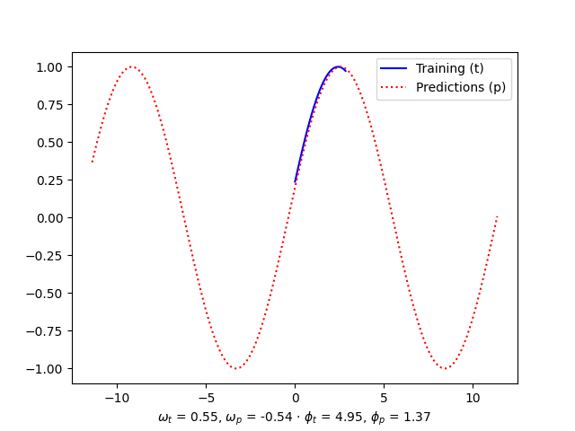
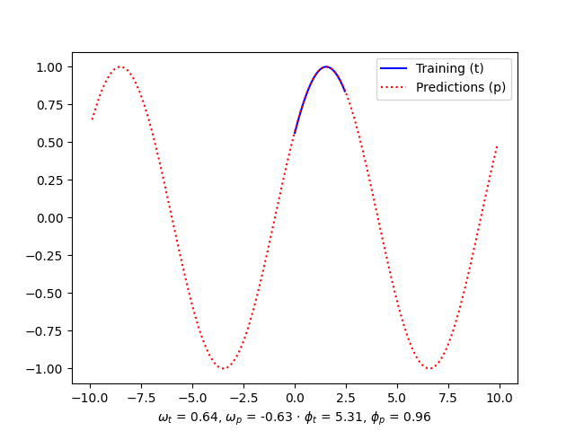
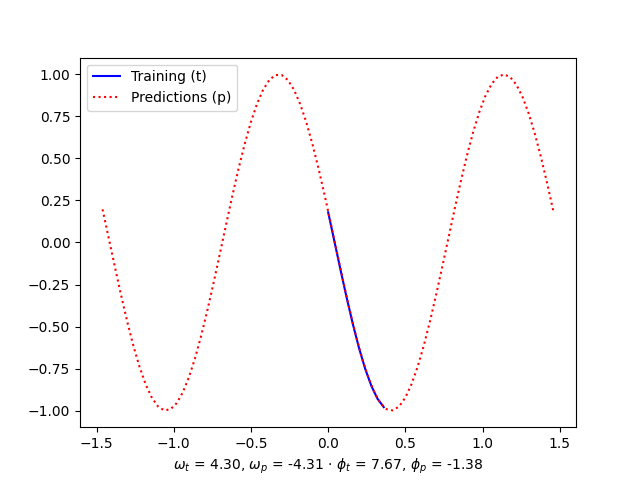
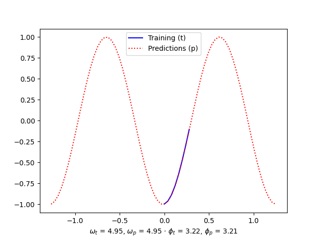
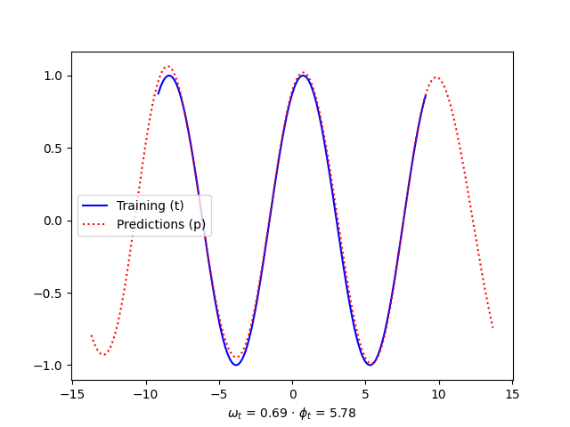
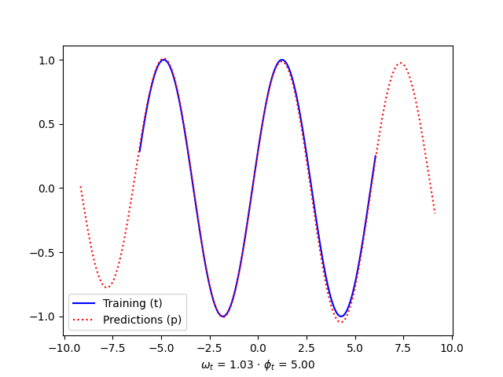
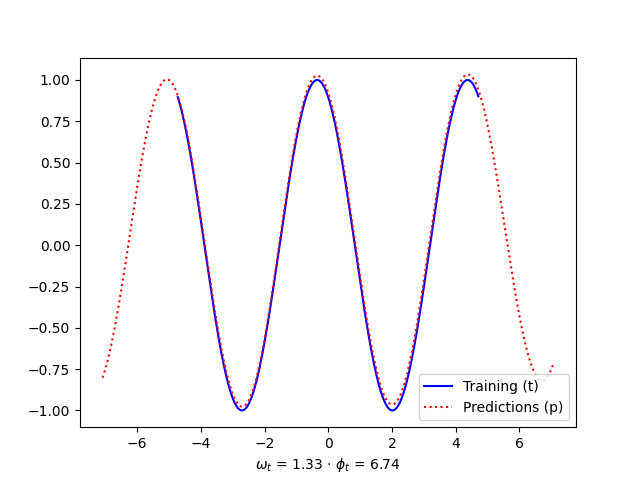
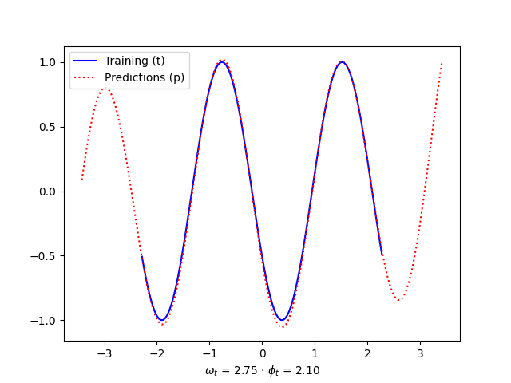

# Experimental Layers

This project contains a set of crazy layers that I created while learning Tensorflow. The layers in this repository shouldn't be considered ready for production and you shouldn't rely on their principles. These are just fun experiments!

This repository is a natural continuation of my [Hello World](https://github.com/elcapo/hello_world/) neural network example.

## Custom Sinusoid Layer

In this exercise I generate a sinusoid (with a random angular velocity and a random phase) and then use a model with a custom `Cosine` layer to estimate the parameters.

```python
import numpy as np
import matplotlib.pyplot as plt

from experimental_layers.datasets import RandomSinusoid
from experimental_layers.models import SinusoidalLayerModel

# Prepare the training data

sinusoid = RandomSinusoid()
x_train, y_train = sinusoid.get()

# Train the model

model = SinusoidalLayerModel()
model.train(x_train, y_train)

# Test the model

x_validate, y_validate = sinusoid.get(-2, 2)
y_predicted = model.predict(x_validate)

# Plot the results

plt.plot(
    x_train,
    y_train,
    color='blue', label='Training (t)')

plt.plot(
    x_validate,
    y_predicted,
    color='red', linestyle='dotted', label='Predictions (p)')

angular_velocity_label = "$\omega_t$ = {:.2f}, $\omega_p$ = {:.2f}".format(
    sinusoid.angular_velocity,
    model.get_angular_velocity())

phase_label = "$\phi_t$ = {:.2f}, $\phi_p$ = {:.2f}".format(
    sinusoid.phase,
    model.get_phase())

plt.xlabel(angular_velocity_label + " · " + phase_label)
plt.legend()

plt.savefig("images/sinusoid-wt-{:.2f}-pt-{:.2f}.png".format(
    sinusoid.angular_velocity,
    sinusoid.phase))
plt.show()
```

### Examples

Here are some examples of results generated with the code above.






### Limitations

#### Need of Sampling the Training Dataset

Note that for the code to work properly the training samples must be cutted. In the examples, the data used for the training is just a tiny fraction of the period of the sinusoid being studied. This is due to the fact that if we add one or more entire periods, the loss function would suffer trying to make estimates.

#### Limited to Sinusoids

As the neural network has a sinusoidal output layer, it only knows how to predict sinusoids. What means that this approach wouldn't even try to approximate other types of periodical functions.

### Warnings

If you check carefully the numbers that we extracted from the predictions, you'll find two almost inevitable issues:

1. the angular velocity was found sometimes with negative sign,
2. the phase can be found with added (or subtracted) multiples of $2 \pi$.

## Custom Snake Activation

A much more flexible approach is the one suggested in **Neural Networks Fail to Learn Periodic Functions and How to Fix It**, by Liu Ziyin, Tilman Hartwig and Masahito Ueda (see [https://arxiv.org/abs/2006.08195](https://arxiv.org/abs/2006.08195)):

> As a fix of this problem, we propose a new activation, namely, $x+sin2(x)$, which achieves the desired periodic inductive bias to learn a periodic function while maintaining a favorable optimization property of the ReLU-based activations.

```python
import numpy as np
import matplotlib.pyplot as plt

from experimental_layers.datasets import RandomSinusoid
from experimental_layers.models import SnakeActivationModel

# Prepare the training data

sinusoid = RandomSinusoid()
x_train, y_train = sinusoid.get(-2, 2)

# Train the model

model = SnakeActivationModel()
history = model.train(x_train, y_train, epochs=100, learning_rate=0.01)

# Test the model

x_validate, y_validate = sinusoid.get(-3, 3)
y_predicted = model.predict(x_validate)

# Plot the results

plt.plot(
    x_train,
    y_train,
    color='blue', label='Training (t)')

plt.plot(
    x_validate,
    y_predicted,
    color='red', linestyle='dotted', label='Predictions (p)')

angular_velocity_label = "$\omega_t$ = {:.2f}".format(
    sinusoid.angular_velocity)

phase_label = "$\phi_t$ = {:.2f}".format(
    sinusoid.phase)

plt.xlabel(angular_velocity_label + " · " + phase_label)
plt.legend()

plt.savefig("images/snake-wt-{:.2f}-pt-{:.2f}.png".format(
    sinusoid.angular_velocity,
    sinusoid.phase))
plt.show()
```

### Examples

Here are some examples of results generated with the code above. Note how, in this cases we didn't have to cut the data shown during the training to pieces tinier than a period.






## Installation

This project was written with [Poetry](https://python-poetry.org). The following instructions should be sufficient for you to start using it.

```bash
git clone https://github.com/elcapo/experimental_layers.git
cd experimental_layers
poetry install
```

> Note that you'll need to install **git**, **python** and **poetry** to get this working.

## Usage

Once installed, use **Poetry**'s shell to interact with the package.

```bash
poetry shell # then
python       # and have fun
```